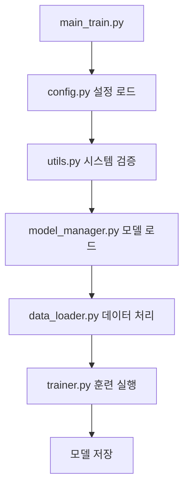
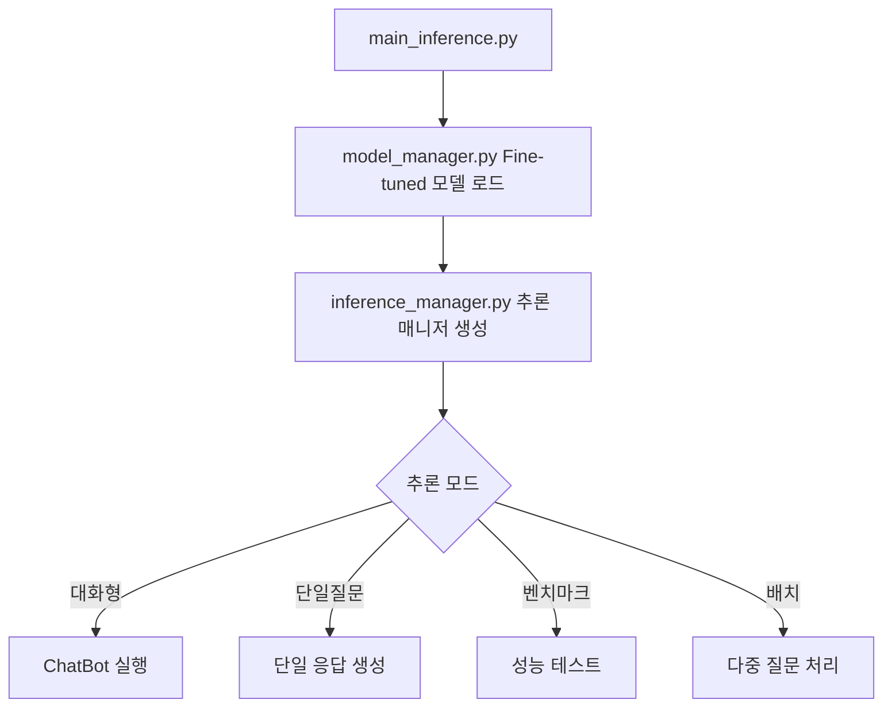

# 프로젝트 구조

## 📁 디렉토리 구조

```
llama_finetune_project/
├── 📄 config.py                    # 설정 파일 (모델, 훈련, 추론 설정)
├── 📄 data_loader.py               # 데이터 로딩 및 전처리
├── 📄 model_manager.py             # 모델 로딩 및 관리
├── 📄 trainer.py                   # 훈련 관련 유틸리티
├── 📄 inference_manager.py         # 추론 및 텍스트 생성
├── 📄 utils.py                     # 공통 유틸리티 함수
├── 📄 main_train.py                # 메인 훈련 스크립트
├── 📄 main_inference.py            # 메인 추론 스크립트
├── 📄 run_scripts.sh               # 실행 스크립트 모음
├── 📄 requirements.txt             # Python 패키지 의존성
├── 📄 civil_law_qa_dataset.csv     # Q/A 데이터셋 (별도 생성 필요)
├── 📄 README.md                    # 프로젝트 설명서
├── 📄 PROJECT_STRUCTURE.md         # 이 파일
└── 📁 fine_tuned_model/            # 훈련된 모델 저장 디렉토리 (훈련 후 생성)
    ├── adapter_config.json
    ├── adapter_model.bin
    ├── tokenizer.json
    ├── tokenizer_config.json
    └── training_stats.json
```

## 📋 파일별 기능 설명

### 🔧 핵심 모듈

#### `config.py`
- **역할**: 전역 설정 관리
- **주요 클래스**:
  - `ModelConfig`: 모델 관련 설정
  - `LoRAConfig`: LoRA fine-tuning 설정
  - `TrainingConfig`: 훈련 파라미터
  - `InferenceConfig`: 추론 설정
  - `SystemConfig`: 시스템 환경 설정
- **주요 함수**:
  - `format_prompt()`: 프롬프트 포맷팅
  - `get_system_prompt()`: 시스템 프롬프트 생성

#### `data_loader.py`
- **역할**: 데이터 로딩 및 전처리
- **주요 클래스**:
  - `DataLoader`: CSV 데이터 로딩 및 토크나이징
- **주요 기능**:
  - CSV 파일 읽기 및 검증
  - 프롬프트 포맷팅
  - 토크나이징 및 Dataset 생성
  - 데이터 통계 정보 제공

#### `model_manager.py`
- **역할**: 모델 로딩 및 관리
- **주요 클래스**:
  - `ModelManager`: 훈련용 모델 관리
  - `InferenceModelManager`: 추론용 모델 관리
- **주요 기능**:
  - 토크나이저 및 모델 로딩
  - LoRA 설정 및 적용
  - Fine-tuned 모델 로딩
  - GPU 메모리 관리

#### `trainer.py`
- **역할**: 모델 훈련 관리
- **주요 클래스**:
  - `CustomTrainer`: 커스텀 트레이너
  - `TrainingManager`: 훈련 프로세스 관리
- **주요 기능**:
  - 훈련 인자 설정
  - 데이터 콜레이터 생성
  - 훈련 실행 및 모니터링
  - 모델 저장

#### `inference_manager.py`
- **역할**: 추론 및 텍스트 생성
- **주요 클래스**:
  - `InferenceManager`: 추론 관리
  - `ChatBot`: 대화형 챗봇
- **주요 기능**:
  - 텍스트 생성
  - 대화형 인터페이스
  - 배치 추론
  - 성능 벤치마크

#### `utils.py`
- **역할**: 공통 유틸리티 함수
- **주요 기능**:
  - 로깅 설정
  - 시스템 요구사항 확인
  - GPU 정보 및 메모리 관리
  - 파일 입출력 유틸리티
  - 진행 상황 추적

### 🚀 실행 스크립트

#### `main_train.py`
- **역할**: 메인 훈련 스크립트
- **주요 기능**:
  - 명령행 인자 처리
  - 전체 훈련 파이프라인 실행
  - 환경 설정 및 검증
  - 훈련 통계 저장
- **사용법**:
  ```bash
  python3 main_train.py --csv_path data.csv --output_dir ./model
  ```

#### `main_inference.py`
- **역할**: 메인 추론 스크립트
- **주요 기능**:
  - 다양한 추론 모드 지원
  - 대화형/단일질문/배치 처리
  - 성능 벤치마크
  - 결과 저장
- **사용법**:
  ```bash
  python3 main_inference.py --model_path ./model --interactive
  ```

#### `run_scripts.sh`
- **역할**: 통합 실행 스크립트
- **주요 기능**:
  - 다양한 실행 모드 제공
  - 시스템 점검
  - 전체 파이프라인 실행
  - 사용자 친화적 인터페이스
- **사용법**:
  ```bash
  ./run_scripts.sh train    # 훈련 실행
  ./run_scripts.sh chat     # 대화형 추론
  ./run_scripts.sh full     # 전체 파이프라인
  ```

## 🔄 실행 플로우

### 훈련 플로우


### 추론 플로우


## ⚙️ 설정 관리

### 주요 설정 항목

#### 모델 설정 (`ModelConfig`)
- `model_name`: 베이스 모델 이름
- `max_length`: 최대 시퀀스 길이
- `torch_dtype`: 모델 데이터 타입
- `load_in_8bit`: 8bit 양자화 사용

#### LoRA 설정 (`LoRAConfig`)
- `r`: LoRA rank (16)
- `lora_alpha`: 스케일링 팩터 (32)
- `lora_dropout`: 드롭아웃 비율 (0.1)
- `target_modules`: 타겟 모듈 목록

#### 훈련 설정 (`TrainingConfig`)
- `batch_size`: 배치 크기 (4)
- `gradient_accumulation_steps`: 그래디언트 누적 (4)
- `learning_rate`: 학습률 (2e-4)
- `num_train_epochs`: 에폭 수 (3)

## 🎯 사용 시나리오

### 1. 기본 훈련 및 추론
```bash
# 1. 시스템 확인
./run_scripts.sh check_system

# 2. CSV 파일 확인
./run_scripts.sh check_csv

# 3. 훈련 실행
./run_scripts.sh train

# 4. 대화형 추론
./run_scripts.sh chat
```

### 2. 커스텀 설정으로 훈련
```bash
python3 main_train.py \
    --csv_path my_data.csv \
    --output_dir ./custom_model \
    --batch_size 2 \
    --epochs 5 \
    --learning_rate 1e-4
```

### 3. 다양한 추론 모드
```bash
# 단일 질문
python3 main_inference.py \
    --model_path ./fine_tuned_model \
    --question "전세권이란 무엇인가요?"

# 파일의 여러 질문 처리
python3 main_inference.py \
    --model_path ./fine_tuned_model \
    --questions_file questions.txt \
    --output_file results.md

# 성능 벤치마크
python3 main_inference.py \
    --model_path ./fine_tuned_model \
    --benchmark
```

## 🔍 모니터링 및 디버깅

### 로그 파일
- `training_YYYYMMDD_HHMMSS.log`: 훈련 로그
- `inference_YYYYMMDD_HHMMSS.log`: 추론 로그

### 저장되는 파일
- `training_stats.json`: 훈련 통계
- `adapter_config.json`: LoRA 설정
- `adapter_model.bin`: Fine-tuned 가중치

### GPU 메모리 모니터링
```bash
# 실시간 GPU 모니터링
watch -n 1 nvidia-smi

# Python에서 메모리 확인
python3 -c "
from model_manager import check_gpu_memory
check_gpu_memory()
"
```

## 🛠️ 커스터마이징

### 새로운 설정 추가
1. `config.py`에 새로운 설정 클래스 추가
2. 관련 모듈에서 설정 사용
3. 명령행 인자 추가 (필요시)

### 새로운 데이터 포맷 지원
1. `data_loader.py`의 `DataLoader` 클래스 확장
2. 새로운 로딩 함수 추가
3. 포맷 검증 로직 추가

### 새로운 추론 모드 추가
1. `inference_manager.py`에 새로운 메서드 추가
2. `main_inference.py`에 명령행 옵션 추가
3. `run_scripts.sh`에 새로운 명령 추가

## 📈 성능 최적화

### 메모리 최적화
- 8bit 양자화 (`load_in_8bit=True`)
- 그래디언트 체크포인팅
- 배치 크기 조정
- 시퀀스 길이 제한

### 속도 최적화
- FP16 사용
- 효율적인 데이터 로딩
- GPU 메모리 관리
- 불필요한 로그 제거

이 구조는 RTX 4060 8GB 환경에서 최적화되어 있으며, 각 모듈이 독립적으로 작동하면서도 유기적으로 연결되어 있습니다.